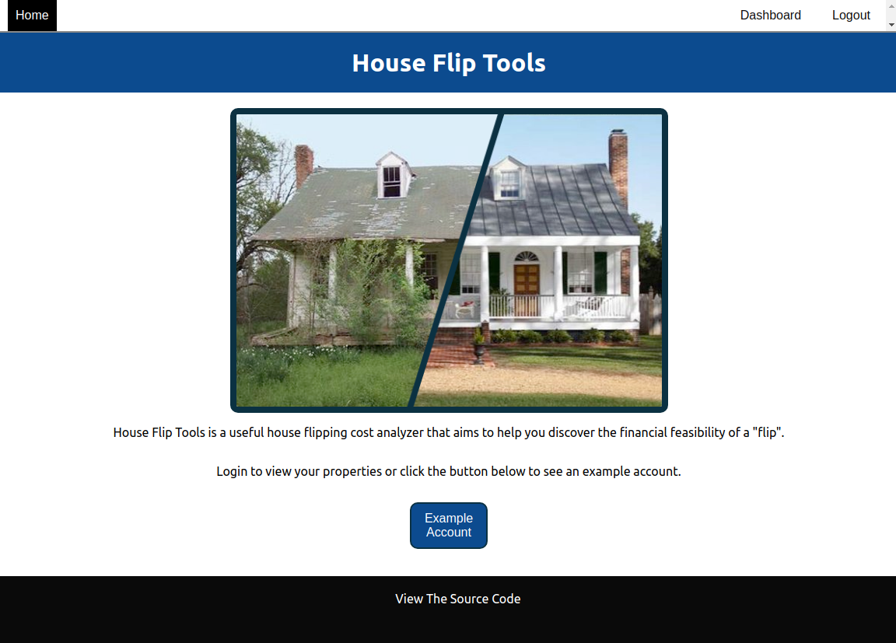
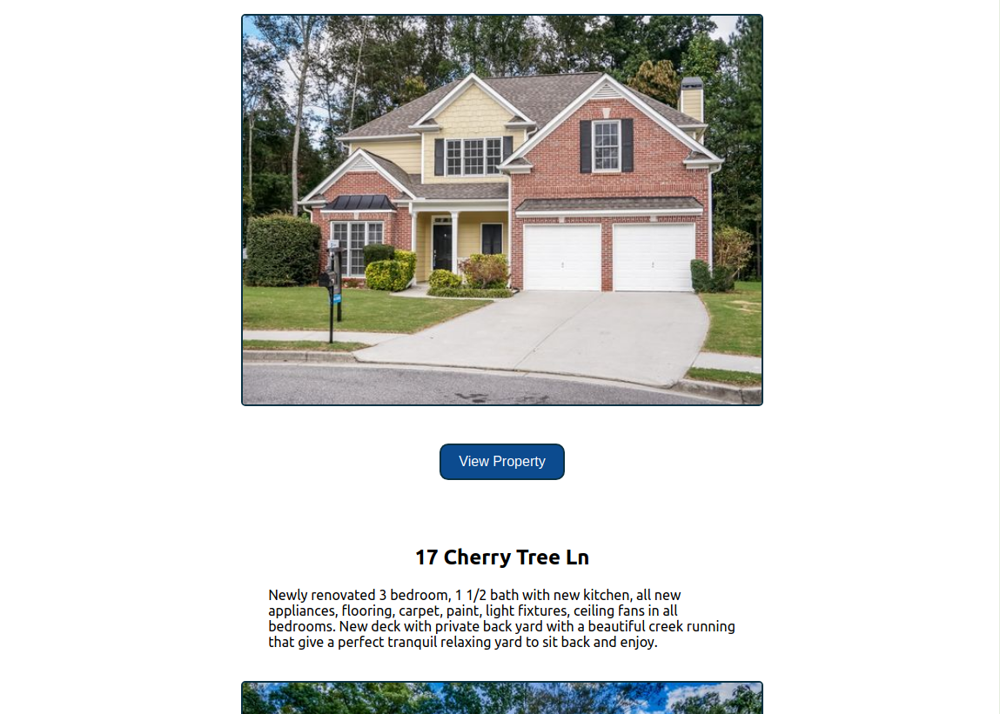
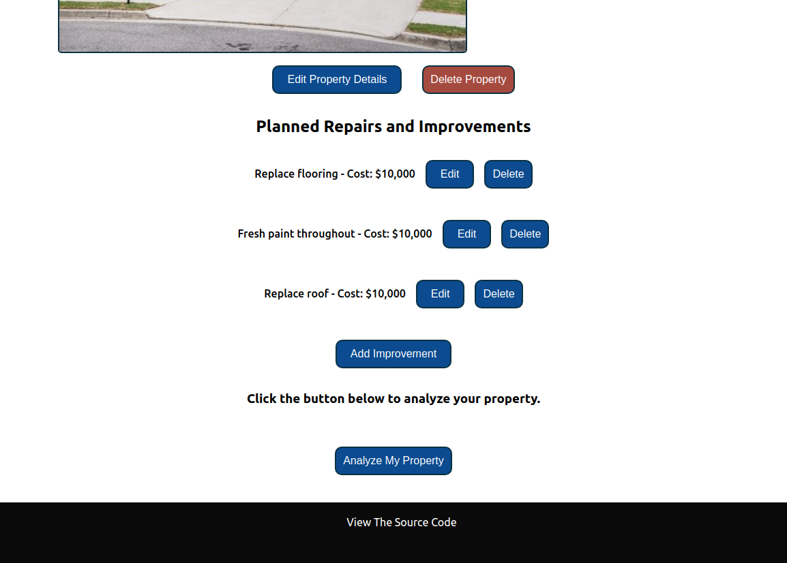
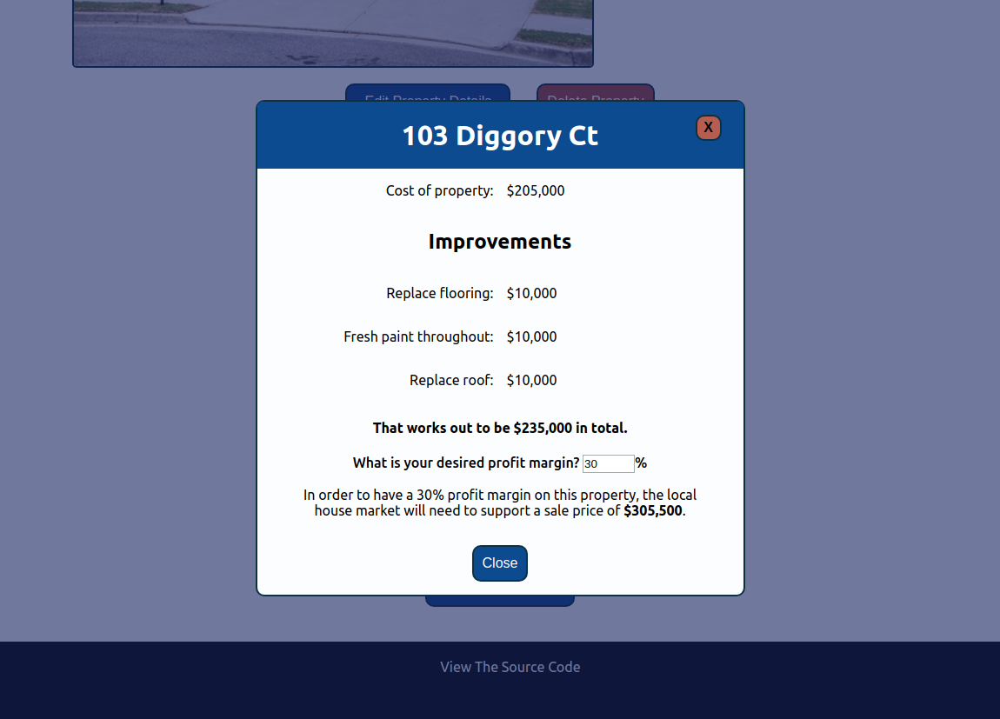

# House Flip Tools
## A cost/profit analyzer that helps you figure out your house flipping project

You can visit a live version of this app here: [House Flip Tools](https://murmuring-depths-75325.herokuapp.com/)

### How to use House Flip Tools

1. Create an account and login or check out the example account.

2. View a specific properties details by clicking "View Property", If you don't have any properties, click "Add property".

3. After you have edited the property details and added and repairs or improvements, click "Analyze My Property" to see your estimate.

4. While viewing the analysis, you can adjust the profit margin to your desired percentage.

### Technology used

The House Flip Tools was built using React, React Router, Redux, Redux Form and Enzyme for testing. The back-end utilized Node with Express, Morgan for logging, Sequelize for interfacing with the PostgreSQl database, Passport with bcryptjs for all authentication, and Mocha with Chai for the testing suite.

I had a blast building this project. I especially loved learning how to incorporate Redux into the react ecosystem as it was my first time doing so. It was lots of fun to build.
